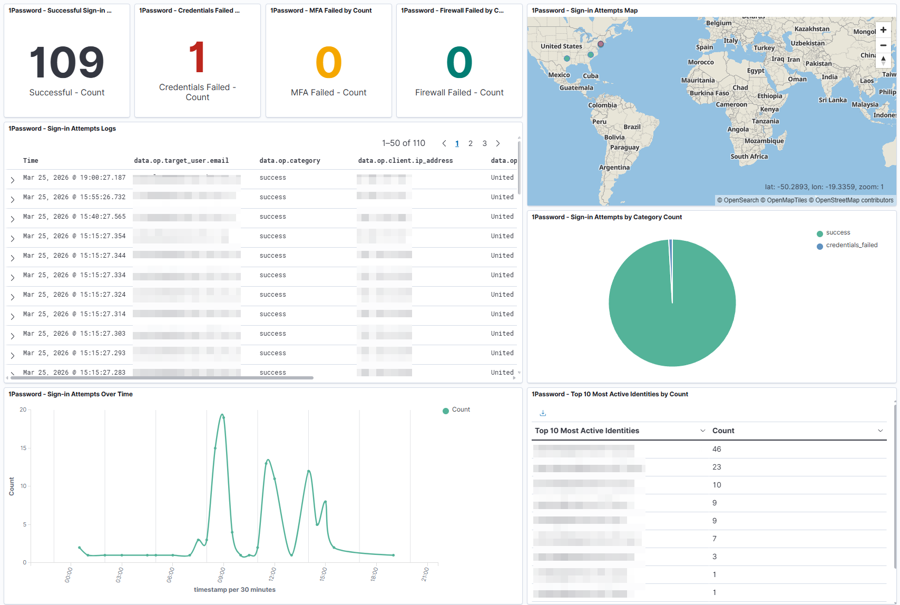
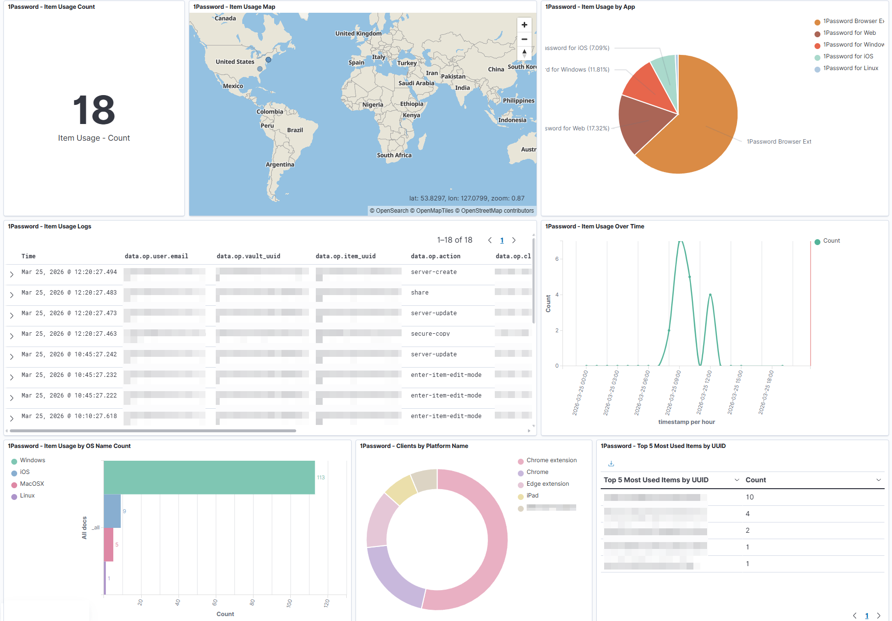

# 1Password Events API Wazuh Integration

Wazuh wodle that ingests **audit events**, **sign-in attempts**, and **item usage events** from the 1Password Events API v2 into Wazuh SIEM.

Designed for organizations and MSSPs/MSPs monitoring client 1Password accounts.

---

## Dashboard



*Custom Wazuh - 1Password dashboard, showing sign-in attempt events and metrics.*



*Custom Wazuh - 1Password dashboard, showing item usage events and metrics.*

---

## Features

- **Three event streams** — audit events (admin actions), sign-in attempts (auth activity), item usage (vault access).
- **Cursor-based pagination** — efficient incremental polling with automatic position tracking. No time-chunking complexity.
- **Single wodle block** — one scheduled command drives all three event streams.
- **Multi-tenant / MSP mode** — monitor multiple client 1Password accounts from a single Wazuh installation via `OP_TOKENS_FILE`.
- **Startup introspect** — validates the bearer token and discovers authorized features before polling.
- **Independent failure isolation** — one stream failure never prevents the others. Every failure produces a structured error event.
- **Automatic 429 retry** — reads the `Retry-After` header and retries once on rate limit, capped at 60 seconds.
- **Atomic state management** — `tempfile` + `os.replace` ensures a process kill mid-write never corrupts state.
- **Secure credential chain** — systemd encrypted credentials > `.secrets` file > environment variables. Credentials are never logged.
- **True nested JSON** — session, location, client, actor, and all 1Password objects are emitted as native JSON, enabling rich OpenSearch queries.
- **Zero external Python dependencies** — stdlib only.

---

## Installation

1. Copy `wodle/*` to `/var/ossec/wodles/onepassword/` on the Wazuh manager. Create `.secrets` from `.secrets.example` — set `OP_BEARER_TOKEN`. Set permissions `chmod 640, chown root:wazuh`.
2. Copy `rules/onepassword_rules.xml` to `/var/ossec/etc/rules/` and `rules/onepassword_decoder.xml` to `/var/ossec/etc/decoders/`.
3. Add a wodle stanza to `/var/ossec/etc/ossec.conf` using the example in [artifacts/configs/ossec_onepassword.conf](artifacts/configs/ossec_onepassword.conf).
4. Restart Wazuh manager: `systemctl restart wazuh-manager`
5. *(Optional)* Import pre-built dashboards: in **Wazuh Dashboard > Stack Management > Saved Objects**, click **Import** and upload the `.ndjson` files from [artifacts/objects/](artifacts/objects/).
6. *(Optional)* Enable map visualizations by adding the geopoint pipeline processor. See [artifacts/guides/geopoint_setup.md](artifacts/guides/geopoint_setup.md) for step-by-step instructions.

---

## Repository structure

```
wazuh-1password/
├── wodle/
│   ├── onepassword.py             <- Entry point, CLI, orchestration
│   ├── onepassword_events.py      <- Generic cursor-paginated event fetcher
│   ├── onepassword_utils.py       <- Auth, HTTP, atomic state, emit, logging, secrets
│   ├── run.sh                     <- Runtime config wrapper (ossec.conf <command> target)
│   └── .secrets.example           <- Credentials template (copy to .secrets)
├── rules/
│   ├── onepassword_rules.xml      <- Custom Wazuh rules (IDs 100700-100799)
│   └── onepassword_decoder.xml    <- JSON decoder registration
├── artifacts/
│   ├── configs/
│   │   └── ossec_onepassword.conf            <- ossec.conf wodle stanza example
│   ├── guides/
│   │   ├── configuration.md                  <- All env vars, CLI flags, multi-tenant setup
│   │   ├── rules_reference.md                <- Rule catalog with field reference
│   │   ├── troubleshooting.md                <- Test commands, common errors
│   │   └── geopoint_setup.md                 <- Geopoint pipeline setup guide
│   ├── objects/
│   │   ├── 1Password - Item Usage.ndjson     <- Wazuh dashboards (import via Saved Objects)
│   │   └── 1Password - Sign-in Attempts.ndjson
│   └── images/                               <- Dashboard screenshots for README
├── .gitignore
├── CHANGELOG.md
└── README.md
```

---

## How it works

```
ossec.conf <wodle command>
    └-> run.sh  (sets runtime config; execs onepassword.py)
            └-> onepassword.py  (parses args, loads state, introspects token)
                    ├-> POST /api/v2/auditevents    -> emit() -> stdout
                    ├-> POST /api/v2/signinattempts  -> emit() -> stdout
                    └-> POST /api/v2/itemusages      -> emit() -> stdout
                                    |
                          onepassword_utils.py
              (bearer auth, HTTP POST, atomic state, emit, secrets)
                                    |
                    Secret priority chain (first match wins):
                    [systemd $CREDENTIALS_DIRECTORY]
                              > [.secrets file]
                              > [env vars]

stdout --> Wazuh wodle manager --> onepassword_decoder.xml --> onepassword_rules.xml
                                                                         |
                                                             OpenSearch / Dashboard
```

Each event is emitted as a single JSON line. All 1Password data lives under an `op` namespace object to avoid collisions with Wazuh's reserved field names. In rules, fields are referenced as `op.event_type`, `op.action`, etc. In OpenSearch they appear as `data.op.event_type`, `data.op.action`.

---

## Requirements

- Wazuh 4.4 or later
- Python 3.8 or later on the Wazuh manager host or agent
- Network access to `events.1password.com` over HTTPS (port 443)
- 1Password Business subscription with Events Reporting enabled
- Bearer token from 1Password admin console (Integrations > Events Reporting)

---

## Reference docs

- [Configuration reference](artifacts/guides/configuration.md) — all environment variables, CLI flags, multi-tenant setup
- [Rules reference](artifacts/guides/rules_reference.md) — rule families, severity mapping, field reference
- [Troubleshooting](artifacts/guides/troubleshooting.md) — test commands, common errors, state reset, backfill
- [GeoPoint setup](artifacts/guides/geopoint_setup.md) — pipeline processor for map visualizations
